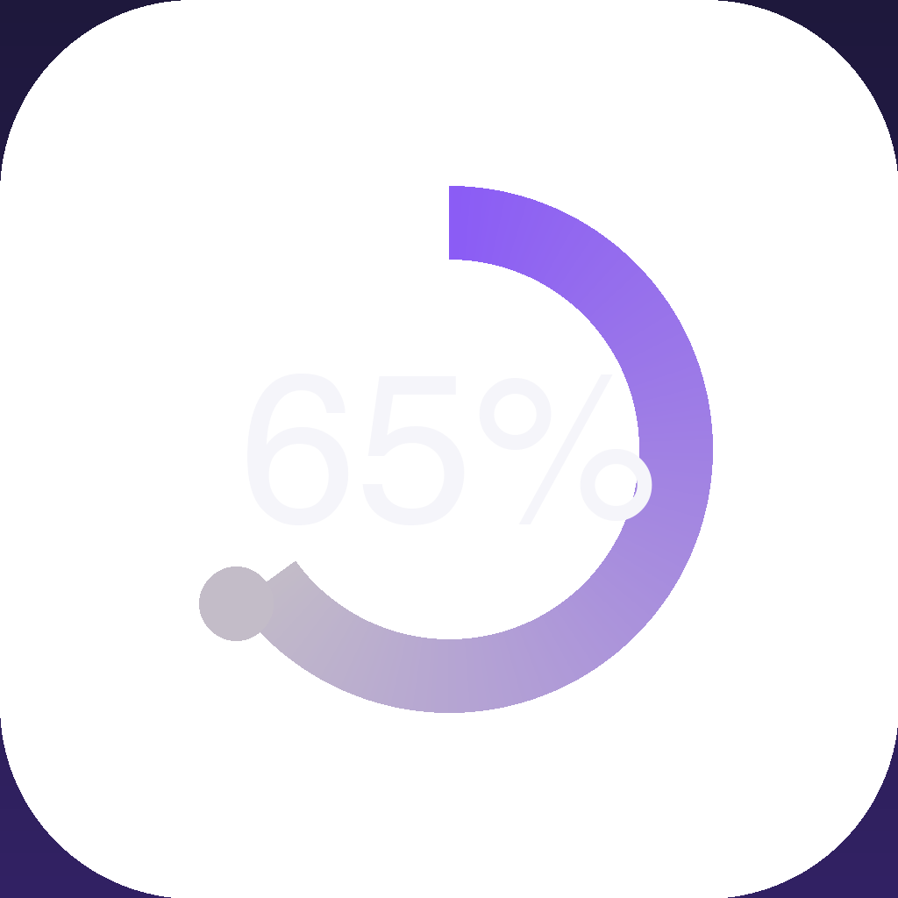

# Kimi Quota Bar · Kimi 套餐额度菜单栏卡片

一个常驻 macOS 菜单栏 / Windows 托盘的小卡片，实时显示你的 Kimi 套餐额度：
**总量（月度）· 5 小时窗口 · 7 天窗口**，每 60 秒自动刷新。



## 功能

- 菜单栏圆环图标，**左键点击**显示 / 隐藏卡片，**右键**菜单（立即刷新 / 退出）
- 卡片为系统级玻璃质感：macOS 26+ 用原生液态玻璃（NSGlassEffectView），
  旧版 macOS 回退 NSVisualEffectView，Windows 用 Acrylic
- 卡片可拖动，位置自动记忆；点击其他窗口不会关闭卡片；
  全屏应用下自动隐藏（系统原生行为）
- **贴边缩球**：把卡片拖到屏幕右边缘松手，自动吸附缩成一个小球
  （显示总量百分比圆环）；单击小球或把它拖离边缘即展开回卡片
- 用量着色：< 50% 绿 / < 80% 黄 / ≥ 80% 红，附重置倒计时，百分比两位小数显示
- 显示 Kimi Code 用量占比
- **应用内登录**：微信 / Kimi 手机客户端扫码登录、手机验证码登录；
  自有登录会话加密保存在本机并优先于客户端会话（短信发送受服务端人机验证
  限制时，可一键打开内嵌官方登录页完成验证，令牌自动回传）
- **个人中心**：登录后点击账号图标进入，显示脱敏用户 ID、登录来源、
  会员计划 / 状态 / 到期时间，底部可退出登录（应用内二次确认弹窗）
- **退出登录**：退出后卡片停止跟随任何账号（包括桌面客户端会话），
  显示未登录态；在卡片里重新登录即恢复
- **自动续期**：Kimi 客户端关闭也不怕——访问令牌过期后应用会自己调官方
  刷新接口换新并写回，最长 90 天免登录

> 小知识：点击卡片时颜色会变深一点——这是 macOS 原生玻璃材质的
> 「焦点态」反馈（和系统电池菜单、Spotlight 一致），不是 bug。

## v0.1.2 更新

- **个人中心**：登录后点击账号图标进入，展示脱敏用户 ID、登录来源、
  会员计划 / 等级 / 生效状态 / 到期时间（来自官方 `GetSubscription` 接口）
- **退出登录二次确认**：退出前弹出应用内确认弹窗（取消 / 确认退出），
  文案按登录态区分；退出后卡片显示未登录，桌面客户端登录态不受影响
- **贴边缩球**：卡片拖到屏幕右边缘自动吸附成球，单击或拖离恢复
- **扫码登录修复**：官方接口响应字段为 camelCase，旧版解析丢令牌导致
  「扫码成功但面板不跳转」，已修复并增加失败提示
- **网页登录修复**：内嵌登录窗口改为主线程创建并绕过系统代理，
  修复白屏、无法关闭
- 额度百分比改为两位小数显示

## 数据从哪来（重要）

应用**不内置任何账号信息**。默认读取的是
**本机 Kimi 桌面客户端当前登录账号**的本地会话：

1. 读取 `kimi-desktop/bridge-store/token-store.json`（Chromium OSCrypt 加密）
2. 用本机保存的 OSCrypt 密钥解密：macOS 从钥匙串读取 `kimi-desktop Safe Storage`
   （首次运行会弹授权框，点「始终允许」即可）；Windows 用 DPAPI 解开
   `Local State` 里的密钥再做 AES-256-GCM 解密（无弹窗）
3. 检查访问令牌有效期：新鲜就直接用；快过期时用文件里的刷新令牌调用官方接口
   `www.kimi.com/api/auth/token/refresh` 换新，并把轮转后的新令牌对**加密写回**原文件，
   桌面客户端不受影响
4. 调用官方额度接口 `kimi.gateway.membership.v2.MembershipService/GetSubscriptionStats`

因此：**谁在 Kimi 客户端登录，就显示谁的额度**；换账号自动跟随。
客户端只需在 90 天内登录过一次即可；超过 90 天未登录导致刷新令牌失效时，
卡片会提示你打开客户端登录一次。

此外也可以**在卡片里直接登录**（点账号图标）：扫码（微信 / Kimi 手机客户端）
或手机验证码。自有登录会话加密保存在 `kimi-quota-bar/session.json`（Windows
DPAPI / macOS 钥匙串派生密钥），存在时优先于客户端会话。退出登录会删除自有会话
并放置退出标记，此后卡片**停止跟随任何账号**、显示未登录态；在卡片里重新登录
自动清除标记。**整个过程不影响 Kimi 桌面客户端自身的登录态**。

前置条件：本机安装并登录过 Kimi 桌面客户端（不需要它一直运行）；或在应用内登录。

> 说明：kimi-code 命令行工具的登录态与套餐额度接口不属于同一签名体系，
> 不能作为本应用的数据来源。

## 安装

到 [Releases](https://github.com/GSSHUO/km/releases) 下载对应平台的安装包：

| 平台 | 文件 |
|---|---|
| macOS Apple Silicon | `Kimi Quota Bar_x.x.x_aarch64.dmg` |
| macOS Intel | `Kimi Quota Bar_x.x.x_x64.dmg` |
| Windows x64 | `.msi` 或 `.exe`（NSIS，免管理员权限安装到当前用户） |

- macOS：拖入「应用程序」。未签名应用首次打开：右键 → 打开（本机自构建通常无此提示）
- 想开机自启：系统设置 → 通用 → 登录项 → 添加「Kimi Quota Bar」

## 自己重新打包

环境：Node.js + Rust（rustup）+ Xcode 命令行工具。

```bash
git clone https://github.com/GSSHUO/km.git
cd km
npm install        # 仅首次
npm run build      # 编译 + 打包，全量约 2 分钟
```

产物：

- App：`src-tauri/target/release/bundle/macos/Kimi Quota Bar.app`
- 安装包：`src-tauri/target/release/bundle/dmg/`

只改了前端（`ui/` 下的 html/css/js）或 Rust 代码后，重跑同一条命令即可。

> 注意：`tauri build` 打 dmg 时会自动清理中间产物 .app；如需单独保留 .app，
> 先 `npx tauri bundle --bundles app` 再 `npx tauri bundle --bundles dmg`。

## 发版（自动生成三端安装包）

项目内置 `.github/workflows/release.yml`，打 tag 推送后 GitHub Actions 并行构建
macOS（Apple Silicon / Intel）与 Windows 安装包，产出为草稿发布（Draft Release），
到 Releases 页面确认后点 Publish 即可：

```bash
git tag v0.1.2 && git push origin v0.1.2
```

也可在 Windows 机器本地打包：装好 Rust 与 VS Build Tools 后执行
`npm install && npm run build`，产物为 `.msi` / `.exe`。

## 自检

不带界面验证「令牌 → 刷新 → 额度接口」整条链路：

```bash
"/Applications/Kimi Quota Bar.app/Contents/MacOS/kimi-quota-bar" --check
"/Applications/Kimi Quota Bar.app/Contents/MacOS/kimi-quota-bar" --check-refresh   # 强制轮转一次令牌
"/Applications/Kimi Quota Bar.app/Contents/MacOS/kimi-quota-bar" --check-login     # 创建扫码 ticket + 渲染二维码
"/Applications/Kimi Quota Bar.app/Contents/MacOS/kimi-quota-bar" --check-qr        # 扫码登录全链路（模拟手机确认，不落盘）
"/Applications/Kimi Quota Bar.app/Contents/MacOS/kimi-quota-bar" --check-session   # 自有会话加解密往返
"/Applications/Kimi Quota Bar.app/Contents/MacOS/kimi-quota-bar" --check-profile   # 个人中心数据（会员摘要 + 用户 ID）
"/Applications/Kimi Quota Bar.app/Contents/MacOS/kimi-quota-bar" --check-weblogin  # 真实打开网页登录窗口并报告加载结果
```

输出为 JSON；`"ok": true` 即链路正常。

## 项目结构

```
kimi-quota-bar/
├── ui/                    # 卡片前端（原生 HTML/CSS/JS，无框架）
│   ├── index.html
│   ├── style.css
│   └── app.js
├── src-tauri/
│   ├── src/main.rs        # 托盘、窗口、毛玻璃、轮询、位置记忆、贴边球形态、登录/个人中心命令
│   ├── src/auth.rs        # 令牌存取加解密、自动续期、官方登录 / 额度 / 会员接口
│   ├── icons/             # 应用图标 + 菜单栏图标
│   └── tauri.conf.json
└── .github/workflows/release.yml
```

## 隐私

除调用 Kimi 官方认证与额度接口外，应用不产生任何网络请求；
令牌、密钥均只存于本机，不出设备。
